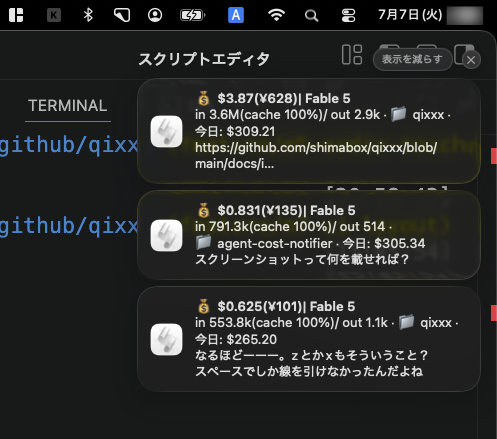
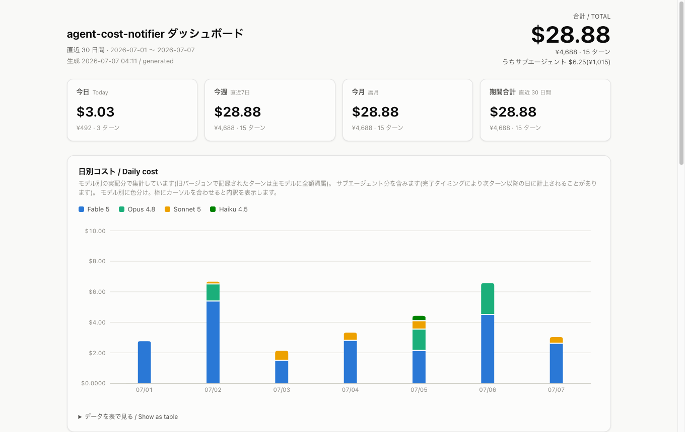
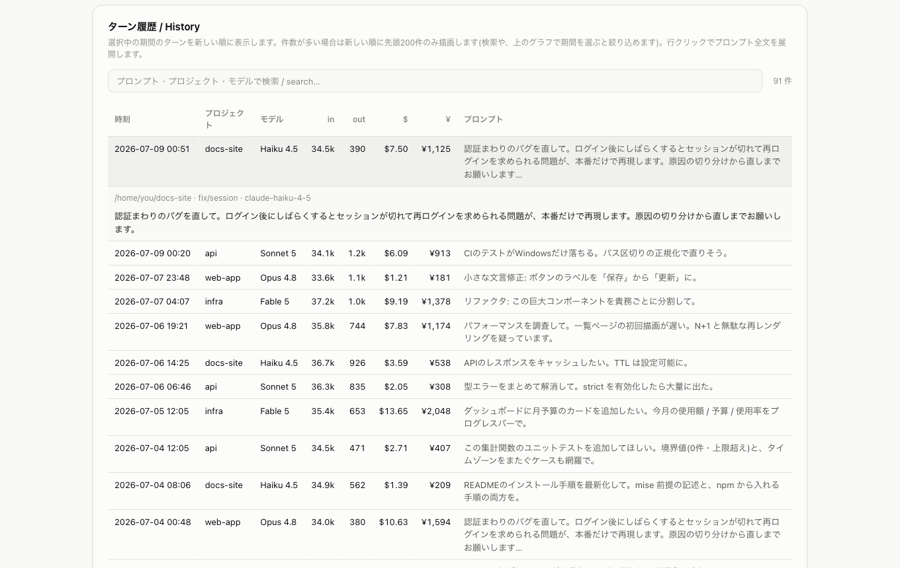

# ccc-notifier

**ccc = Claude Code Cost**(現在は [Codex CLI](docs/codex.md) のコストも同じ仕組みで扱えます)。Claude Code や Codex CLI で **プロンプトを実行するたび**、そのターンにかかったコストを **$(USD)と¥(JPY)の両方** で自動通知するツールです。**5分で導入できます。**

```
💰 API換算 $0.267(¥40)| Fable 5
in 1.2k(cache 40%)/ out 480 · 📁 my-app · 今日: $1.85
バグを直してテストを通してください
```

上が通知の例です(1行目がタイトル、2〜3行目が本文)。応答が完了するたびに OS 通知(任意で Slack 通知も)としてこれが届きます。

> **⚠️ 表示される金額はあくまで概算値です。** transcript のトークン数 × 公開単価表からローカルで計算した参考値であり、Anthropic の請求額と一致することを保証するものではありません。「使いすぎに気づく」ための目安としてご利用ください(詳細は [金額の意味](docs/cost.md))。





## 特徴 / Features

- **ターン毎に自動通知** — Claude Code / Codex CLI の応答が完了するたび(Stop hook)に、そのターンのコストを自動でプッシュ通知します。自分から `/cost` を見に行く必要はありません
- **$ と ¥ を併記** — USD と JPY の両方を毎回表示します(為替レートは自動取得 + キャッシュ + 固定フォールバックの三段構え)
- **プロンプト全文をローカルに履歴保存** — `~/.ccc-notifier/history.jsonl` にそのターンのプロンプト全文を保存します(外部には送信されません)
- **HTMLダッシュボード** — `dashboard` コマンドで、サマリー・コスト推移(**日 / 週 / 月**で切替、横スクロールで過去まで)・モデル別/プロジェクト別内訳・検索できるターン履歴を1枚の HTML(完全自己完結・ライト/ダーク対応)に書き出してブラウザで開きます。棒をクリックするとその期間が選択され、内訳・履歴が連動(「通算」で全期間)。Codex CLI を併用していれば **Claude / Codex** のソースフィルタも使えます
- **月予算(monthly budget)** — 月に使える金額(USD)を設定すると、ダッシュボードに**当月の使用額 / 予算・使用率(%)** をプログレスバーで表示します(`init` の対話、または `ccc-notifier budget <金額>` で設定。Claude Code と Codex CLI の合算です)
- **Codex CLI もそのまま検出** — `init` を実行すると `~/.codex` の有無を見て、あれば Codex にも導入するか聞かれます。通知・履歴・ダッシュボード・`sweep` は Claude Code と全く同じ仕組みで扱います([詳細](docs/codex.md))
- **OS 標準の通知機構のみ使用・追加依存ゼロ** — 通知は macOS では `osascript`、Windows では PowerShell 標準のトースト通知機能のみで送信します(node-notifier 等の外部通知ライブラリには一切依存しません)
- **全処理ローカル・フェイルセーフ設計** — 通知や集計の処理が失敗しても、Claude Code / Codex CLI 本体の応答は絶対にブロックしません

## 必要環境 / Requirements

- Node.js 20 以上(未導入の場合は [Node.js の用意](docs/installing-node.md) を参照してください)
- Claude Code(インストール・利用中であること。`init` は Claude Code の Stop hook を必ず設定します)
- (任意)[Codex CLI](docs/codex.md) を併用している場合は、`init` が自動検出してそのコストも同じ仕組みで通知できます

Windows / WSL2 で使う場合は、環境ごとの手順を [Windows / WSL2 での導入](docs/windows-wsl2.md) にまとめています。

## インストール / Install

### 方法A: npm から(推奨)

```bash
npm install -g ccc-notifier
ccc-notifier init
```

グローバルに入れず一度だけ試すなら `npx ccc-notifier init` でも実行できます。`ccc-notifier` には短縮エイリアス `cccn` もあります(`cccn doctor` など)。

### 方法B: ソースから(開発版・最新を試したいとき)

```bash
git clone https://github.com/shimabox/ccc-notifier.git
cd ccc-notifier
mise install          # mise 利用時(Node.js 20 が自動で入ります)。mise が無ければ Node.js 20 以上を用意してください
npm ci
npm run build
node dist/cli.js init
```

最後の `node dist/cli.js init` が次の「セットアップ」の内容(対話形式のセットアップ)です。

## セットアップ / Setup

> **補足**: 以降に出てくる `npx ccc-notifier <command>` や `npm install -g ccc-notifier` は、npm でインストールした場合(方法A)の表記です。**方法B(ソースから)でインストールした場合は、`npx ccc-notifier <command>` を `node dist/cli.js <command>` に読み替えてください**(リポジトリのディレクトリで実行します)。

1. **セットアップコマンドを実行**

   インストール方法に応じて `init` を実行します。

   - 方法A(npm)の場合: `npx ccc-notifier@latest init`
   - 方法B(ソースから)の場合: `node dist/cli.js init`

2. **質問に答える**

   対話形式で次の4点(Codex CLI を検出した場合はもう1点)を聞かれます。

   - 通知チャネル(OS通知のみ / Slackのみ / OS通知+Slack / 通知なし(記録・ダッシュボードのみ))
   - コスト表示ラベル(API換算 / 実額)
   - USD/JPY のフォールバック為替レート(既定 150円)
   - 月の予算(USD、既定 $400。`0` で無効。ダッシュボードに当月の使用率を表示。詳細は [月予算](docs/monthly-budget.md))
   - (Codex CLI 検出時)Codex にもコスト通知を入れるか(既定 Yes。詳細は [Codex CLI 対応](docs/codex.md))

   完了すると Claude Code の `~/.claude/settings.json` に Stop hook が自動で追記されます。**既存の設定内容(他の hook や設定)は一切変更されず**、書き込み前に必ず `settings.json.bak-<タイムスタンプ>` としてバックアップが作成されます。settings.json が壊れている(JSONとして解析できない)場合は自動編集を諦め、手動で追記する内容を画面に表示するだけで、ファイルには一切書き込みません。

3. **Claude Code(や Codex CLI)で何か実行してみる**

   ひとこと実行して応答が完了すると、通知が届きます。

届かない場合は `npx ccc-notifier doctor` で診断できます。hook登録・設定ファイル・単価表・為替レート・テスト通知・直近セッション合計などを ✅ / ⚠️ / ❌ で表示し、❌ が1つでもあれば終了コード1を返します(通知が来ないときの詳しい対処は [FAQ](docs/faq.md) 参照)。

### 非対話実行(CI・スクリプト向け)/ Non-interactive flags

CI などから非対話で `init` したい場合は次のフラグが使えます。

| フラグ | 説明 |
|---|---|
| `--yes`, `-y` | 対話プロンプトを出さずに実行(非対話には必須) |
| `--os-only` | Slack を無効化し OS通知のみにする |
| `--slack-webhook <url>` | Slack Incoming Webhook URL を指定して有効化 |
| `--slack-only` | Slack のみにする(OS 通知を無効化)。`--slack-webhook` と併用が必須 |
| `--no-notify` | 通知なし(記録・ダッシュボードのみ)。`--os-only` / `--slack-only` / `--slack-webhook` とは併用不可(例: `npx ccc-notifier init --yes --no-notify`。詳細は [設定](docs/configuration.md#通知なしモード記録ダッシュボードのみ--dashboard-only-mode)) |
| `--label <api_equivalent\|actual>` | コスト表示ラベルを指定 |
| `--rate <number>` | USD/JPY フォールバックレートを指定 |
| `--budget <USD>` | 月予算(USD)を指定(0 で無効)。未指定なら既定 **$400**(既存設定があれば維持) |
| `--codex` | Codex CLI にも Stop hook を導入する。既存設定がある環境で素の `init --yes --codex` を実行した場合はCodex hookだけを安全に更新する(`~/.codex` 未検出でも強制導入。詳細は [Codex CLI 対応](docs/codex.md)) |
| `--no-codex` | Codex hook を導入しない(検出しても触らない)。`--codex` とは併用不可 |

アップデート後に古い Codex hook を更新する既存ユーザーは、`npx ccc-notifier init --yes --codex` を一度実行し、Codexを完全に再起動して `/hooks` で Stop / UserPromptSubmit / SubagentStart / SubagentStop の4つを信頼済みにしてください。UserPromptSubmitは追加された新しいhookなので、以前の3つが信頼済みでも別途レビューが必要です。この素のコマンドは既存のSlack・OS通知、予算、単価表示、為替、Claude settingsを変更せず、テスト通知も送りません。設定全体を変更する場合は対話 `init` または設定フラグ付きの非対話initを使います（通常initとして設定ファイル更新・Claude hookマージ・テスト通知が行われます）。

## コマンド一覧 / Commands

| コマンド | 説明 |
|---|---|
| `init` | Stop hook を対話形式でセットアップ(前述のフラグで非対話実行も可) |
| `doctor` | hook登録・設定・単価表・為替・通知・直近セッション合計を診断 |
| `report [--days N] [--json]` | 蓄積した履歴を集計してターミナルに表示(`--days` の既定は30、不正な値も30扱い)。`--json` で機械可読な出力 |
| `dashboard [--all\|--days N] [--no-open] [--out <path>] [--refresh <sec>\|--no-refresh]` | 履歴を可視化した HTML ダッシュボードを生成してブラウザで開く(引数なしは設定期間の直近版 `report.html`、`--all` は全履歴版 `report-all.html`。詳細は [ダッシュボード](docs/dashboard.md)) |
| `sweep [--dry-run] [--days N] [--include-active]` | 過去の未計上分(hook 導入前や後から完了したサブエージェント分)を一括で履歴に取り込む。ローカル走査のみで **Claude API を呼ばず料金ゼロ**・二重計上なし(詳細は [過去分の取り込み](docs/sweep.md)) |
| `history <clear\|redact> [--days N] [--yes]` | 履歴(`history.jsonl`)を削除。`clear` はレコードごと、`redact` はプロンプト全文だけ消去。`--days N` で「N 日より前」だけ対象(詳細は [履歴の削除](docs/dashboard.md#履歴の削除--deleting-history)) |
| `budget [<USD>]` | 月予算(USD)の表示/設定。金額省略で現在の予算と当月の使用率を表示、`budget 400` で設定、`budget 0` で解除(詳細は [月予算](docs/monthly-budget.md)) |
| `mute [30m\|2h\|1d]` | 通知(OS/Slack)を一時停止する。期間省略で無期限、`30m`/`2h`/`1d` で期限付き。**停止中もコスト記録とダッシュボード更新は続きます**(詳細は [設定 / mute](docs/configuration.md#通知の一時停止と再開--pausing--resuming-notifications)) |
| `unmute` | 停止した通知を再開する |
| `uninstall [--purge] [--yes]` | Stop hook を削除。`--purge` を付けると `~/.ccc-notifier` のデータ(設定・履歴・キャッシュ)も削除 |
| `track` | Stop hook から自動的に呼ばれる**内部コマンド**。stdin 経由で JSON を受け取ります。手動実行は不要です |
| `--version`, `-v` | バージョン表示 |
| `--help`, `-h` | ヘルプ表示 |

`report --json` は次のような形の JSON を出力します(スクリプト等への取り込み用)。

```json
{
  "days": 30,
  "daily": [{ "date": "2026-07-06", "turns": 3, "inputTokens": 12345, "outputTokens": 678, "costUSD": 0.42, "costJPY": 63 }],
  "byModel": { "claude-fable-5": { "turns": 2, "costUSD": 0.3, "costJPY": 45 }, "claude-sonnet-5": { "turns": 1, "costUSD": 0.03, "costJPY": 4.5 } },
  "total": { "turns": 3, "inputTokens": 12345, "outputTokens": 678, "costUSD": 0.42, "costJPY": 63, "subagentsUSD": 0.03 }
}
```

金額(`costUSD`・`costJPY`)は**サブエージェント分を含む総額**です。`total.subagentsUSD` はそのうちサブエージェントが占める金額(なければ 0)、`byModel` にはサブエージェントが使ったモデルも含まれます。

## ダッシュボード / Dashboard

`dashboard` コマンドで、サマリー(今日 / 今週 / 今月 / 通算)、コスト推移(日/週/月で切替・横スクロールで過去まで)、モデル別/プロジェクト別内訳、検索・行展開できるターン履歴を HTML に書き出してブラウザで開きます。自動生成物は、毎ターン更新する直近版 `~/.ccc-notifier/report.html`(既定30日)と、ローカル日の最初の正常なターンだけ更新する全履歴版 `~/.ccc-notifier/report-all.html` に分かれます。片方が未生成でも生成方法を示すplaceholderを置くため、ページ内リンクは切れません。履歴・カーソル・生成snapshotは `cache/data.lock/` で直列化されます。履歴の読み込みと解析は正確な当月予算を保つため全履歴が対象です。生成物は **CSS/JS/SVG をすべてインライン化した完全自己完結・オフライン動作・外部通信ゼロ**のファイルで、ライト/ダーク両対応です。

```bash
npx ccc-notifier dashboard            # 設定期間(既定30日)の直近版 report.html を生成して開く
npx ccc-notifier dashboard --all      # 全履歴版 report-all.html を生成して開く
npx ccc-notifier dashboard --days 7   # 直近7日の report.html を生成して開く
```

グラフの棒をクリックするとその期間に内訳・履歴が連動し、全履歴版では「通算」、期間限定版では「対象期間合計」で埋め込まれた全期間に戻せます。直近版は応答完了ごと、全履歴版は1日1回(または手動 `dashboard --all`)更新されます。Codex CLI のレコードがあれば **Claude / Codex** を絞り込むソースフィルタも表示されます(詳細は [Codex CLI 対応](docs/codex.md))。検索・行クリックでプロンプト全文を確認できます:



期間の連動・自動更新・月予算表示・履歴の削除など、詳しくは [ダッシュボード](docs/dashboard.md) を参照してください。

## プライバシー / Privacy

- プロンプトの全文は **ローカルの `~/.ccc-notifier/history.jsonl` にのみ** 保存されます
- OS通知に表示されるプロンプトは、ローカル上で先頭50字程度に切り詰めたものです
- Slack を設定した場合のみ、既定でプロンプト冒頭100字(`sendFullPrompt` で文字数変更・全文送信も可能)がその Slack Webhook 宛に送信されます
- それ以外に外部へ送信されるのは次の2種類の API 呼び出しだけです。いずれもプロンプトやコードの内容を一切含まない、レート・価格を取得するだけのリクエストです
  - 為替レート取得([frankfurter.dev](https://frankfurter.dev/) → 失敗時は [open.er-api.com](https://open.er-api.com/))
  - 単価表取得([LiteLLM の公開JSON](https://github.com/BerriAI/litellm))

## ドキュメント / Documentation

- [Node.js の用意](docs/installing-node.md) — Node.js 20 が未導入の方へ(mise / 公式インストーラ)
- [Windows / WSL2 での導入](docs/windows-wsl2.md) — ネイティブ Windows と WSL2 での手順
- [Codex CLI 対応](docs/codex.md) — 導入・hook の信頼承認・仕組み・制限
- [ダッシュボード](docs/dashboard.md) — 期間の連動・自動更新・履歴の削除
- [月予算 / Monthly budget](docs/monthly-budget.md) — 当月の使用率表示
- [過去分の取り込み / sweep](docs/sweep.md) — hook 導入前・後から完了した分の回収
- [金額の意味](docs/cost.md) — ラベルの意味と、概算値である理由
- [設定 / Configuration](docs/configuration.md) — `config.json` の全キーと通知の一時停止(mute)
- [Slack 通知の有効化](docs/slack.md) — Incoming Webhook の設定
- [仕組み / How it Works](docs/how-it-works.md) — Stop hook から通知までの流れ
- [よくある質問 / FAQ](docs/faq.md) — 通知が来ない・`/cost` との差など

## License

[MIT](LICENSE)
