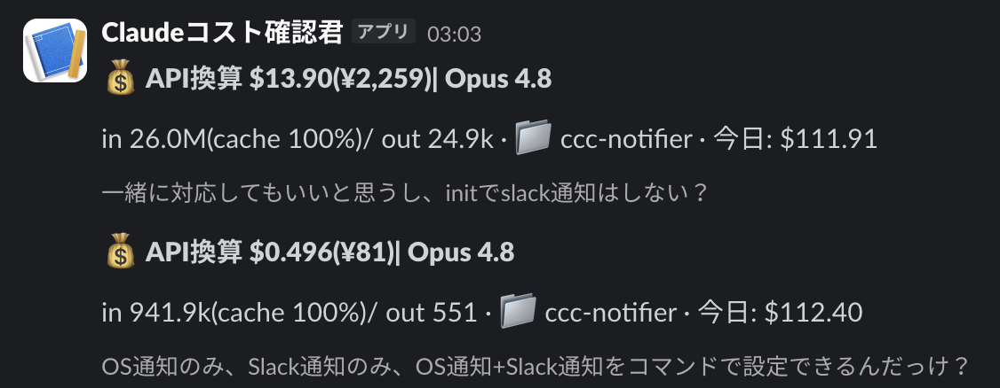

# Slack 通知の有効化 / Enabling Slack Notifications

[← README に戻る](../README.md)

Slack を設定すると、指定したチャンネルへ次のように通知が届きます(タイトル・トークン/コスト概要・プロンプト冒頭の3ブロック):

1. Slack で Incoming Webhook を発行します(Slack App の管理画面で *Incoming Webhooks* を有効化 → *Add New Webhook to Workspace* → 通知したいチャンネルを選択すると `https://hooks.slack.com/services/...` 形式の URL が発行されます)
2. 次のいずれかの方法で設定します。
   - `npx ccc-notifier init` を実行し、「通知チャネル」で *OS通知 + Slack*(OS通知と併用)または *Slackのみ*(OS通知なし)を選んで URL を貼り付ける
   - 非対話: `npx ccc-notifier init --yes --slack-webhook "https://hooks.slack.com/services/XXX"`(OS通知も併用)。Slack だけにしたい場合は `--slack-only` を併用します
   - `~/.ccc-notifier/config.json` を直接編集し、`notify.slack` に `{ "webhookUrl": "...", "promptChars": 100, "sendFullPrompt": false }` を設定(OS通知を切るなら `notify.os` を `false` に)
3. Slack にはタイトル・トークン/コスト概要・プロンプト冒頭(既定100字、`sendFullPrompt: true` で全文)の3ブロックが送信されます。送信は3秒でタイムアウトし、失敗しても(Webhook設定ミスなどがあっても)Claude Code の応答自体には一切影響しません
4. `init` を実行した時点で、Slack を設定していれば **Slack にテスト通知が1回送信**されます(OS通知も有効なら同時に送られます)。あとから確認したいときは `npx ccc-notifier doctor` でも同じテスト通知を送れます。実送信せず中身だけ見たい場合は `CCCN_DRY_RUN=1 npx ccc-notifier doctor` とすると `~/.ccc-notifier/last-notify.json` に書き出されます。届かないときは `~/.ccc-notifier/error.log` に `notifySlack` の記録が残ります
